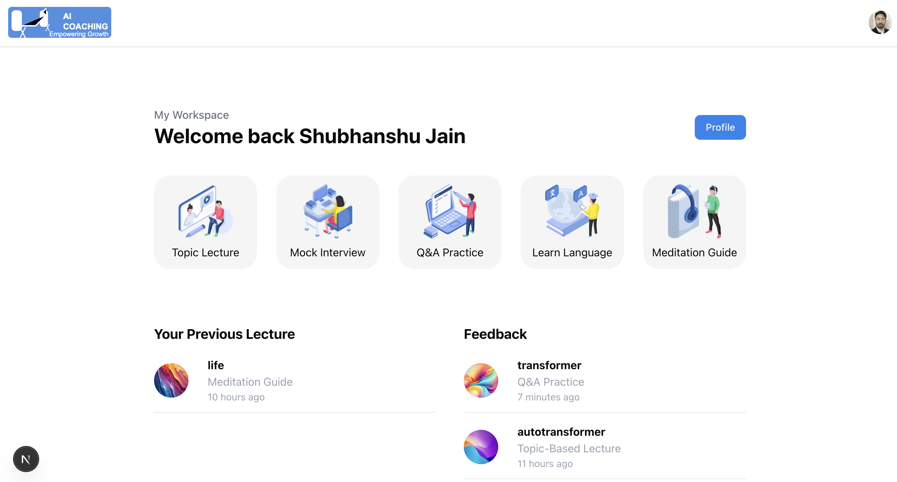
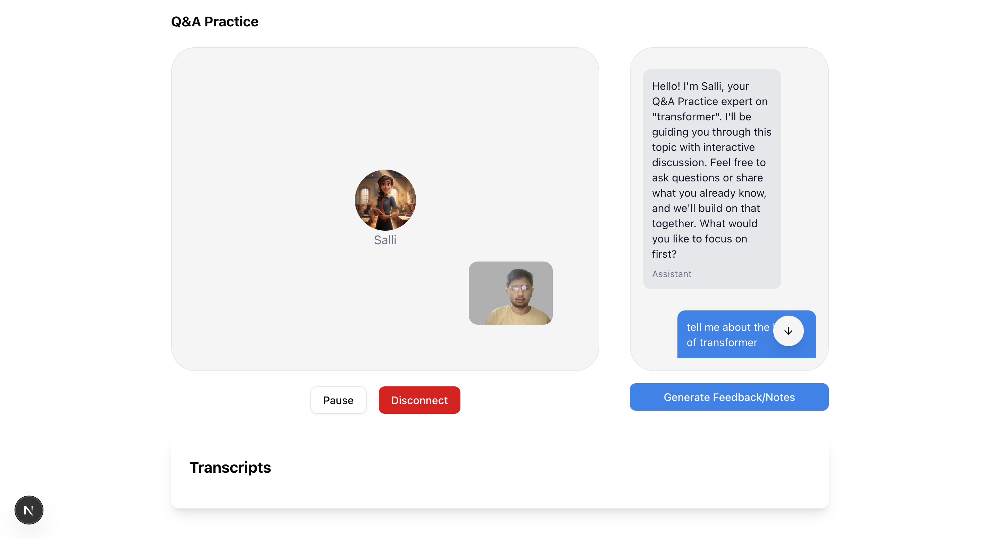
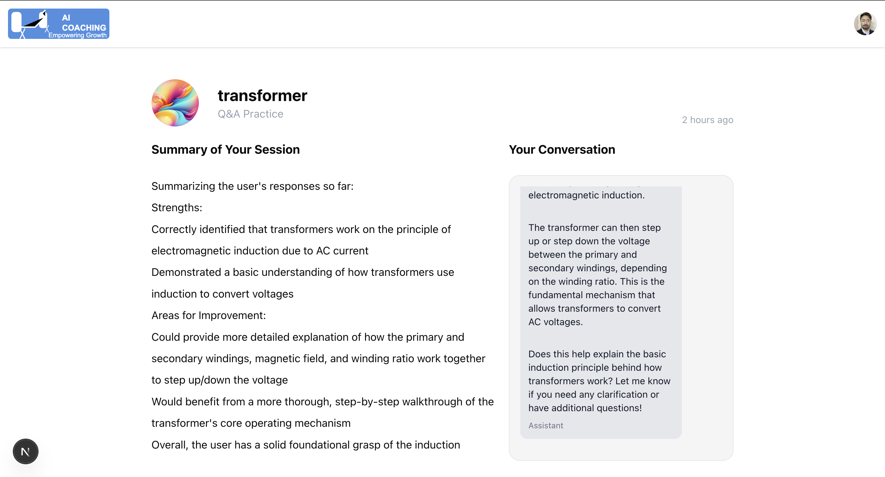
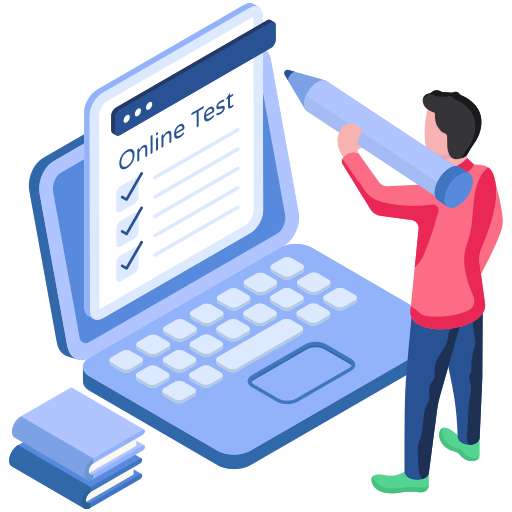
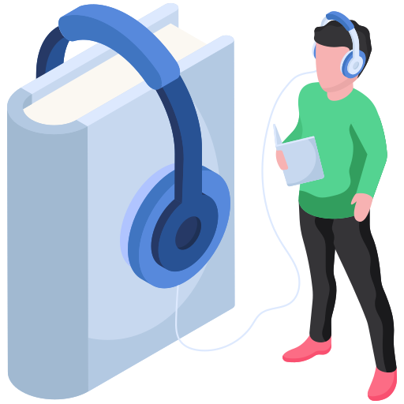

# AI Coaching Platform

An intelligent coaching platform powered by AI that provides personalized learning experiences across multiple domains.

<div align="center">
  
  
  # AI Coaching Dashboard
  
  

  # Discussion Room

  

  # View Summary

  
</div>

## Overview

AI Coaching is a comprehensive learning platform that leverages artificial intelligence to provide personalized coaching experiences. The platform offers various learning modules designed to help users improve their skills, knowledge, and personal development.

## Features

<div style="display: flex; justify-content: space-between; margin-bottom: 20px;">
  
  
  
  
  
</div>

### 1. Topic Lecture

- AI-powered lectures on various topics
- Personalized content delivery
- Interactive learning experience
- Real-time feedback and adjustments

### 2. Mock Interview

- Simulated interview environments
- Real-time feedback on responses
- Industry-specific questions
- Performance analysis and improvement suggestions

### 3. Q&A Practice

- Interactive question-and-answer sessions
- Personalized difficulty adjustment
- Comprehensive explanations
- Progress tracking and analytics

### 4. Language Learning

- Conversational language practice
- Pronunciation feedback
- Vocabulary building
- Grammar assistance and corrections

### 5. Meditation Guide

- Guided meditation sessions
- Personalized mindfulness exercises
- Stress reduction techniques
- Progress tracking and wellness metrics

## Technical Features

- Real-time speech recognition for interactive conversations
- Natural language processing for understanding and responding to queries
- User authentication and session management
- Progress tracking and analytics
- Responsive design for all devices
- Token-based credit system for session management

## User Experience

- Personalized dashboard with progress tracking
- Previous session history and feedback
- Credit system for managing usage
- Profile management
- Real-time interaction with AI coach

## Technology Stack

- Next.js for the frontend framework
- Stack Auth for authentication
- TailwindCSS for styling
- WebSpeech API for voice recognition
- AI/ML models for coaching logic
- Convex for backend services

## Getting Started

1. Clone the repository
2. Install dependencies:

```bash
npm install
```

3. Set up environment variables:

```bash
cp .env.example .env.local
```

4. Run the development server:

```bash
npm run dev
```

## Environment Variables

The following environment variables are required:

- `NEXT_PUBLIC_STACK_API_KEY`: Your Stack Auth API key
- `NEXT_PUBLIC_CONVEX_URL`: Your Convex deployment URL
- `STACK_SECRET_SERVER_KEY , OPENROUTER_API_KEY`: Your Stack Key
- `NEXT_PUBLIC_AI_OPENROUTER`: Openrouter Ai API key
- `CONVEX_SELF_HOSTED_URL`: Convex self hosted key
- `CONVEX_SELF_HOSTED_ADMIN_KEY` Convex self hosted Admin key
- Additional API keys for AI services

## Contributing

Contributions are welcome! Please read our contributing guidelines before submitting pull requests.

## License

This project is licensed under the MIT License - see the LICENSE file for details.

## Support

For support, please open an issue in the GitHub repository or contact our support team.

---

Built with ❤️ by the AI Coaching Team
